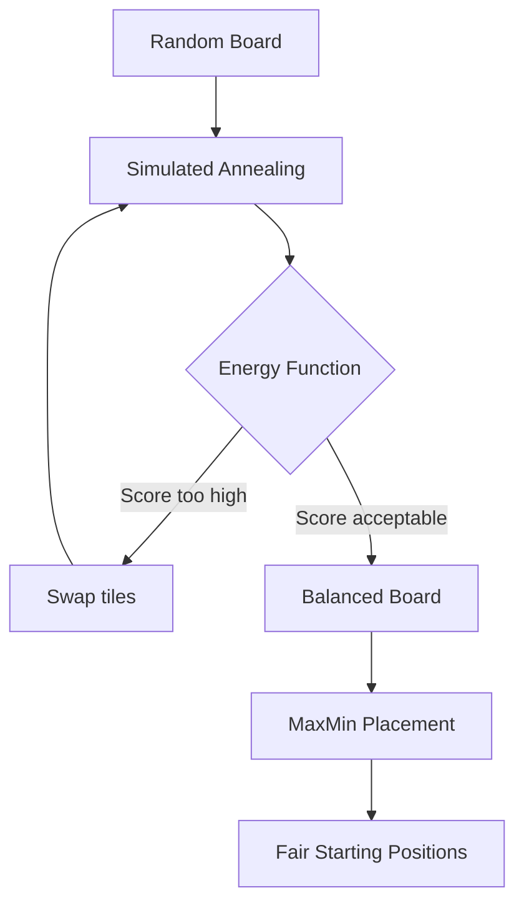

# Algorithms

Catan Forge uses three main algorithms to generate fair maps and suggest balanced starting positions.

| Algorithm | Purpose | File |
|-----------|---------|------|
| [Simulated Annealing](./simulated-annealing.md) | Balance resource and number placement | `src/logic/generation/generator.ts` |
| [Energy Function](./energy-function.md) | Score how "fair" a board layout is | `src/logic/generation/scorer.ts` |
| [MaxMin Fair Allocation](./maxmin-placement.md) | Suggest balanced initial settlements | `src/logic/placement/placements.ts` |

## How They Work Together

1. A random board is generated with shuffled resources and numbers
2. **Simulated Annealing** iteratively improves the layout by swapping tiles
3. Each swap is evaluated by the **Energy Function** — lower energy = fairer board
4. Once optimized, **MaxMin Fair Allocation** assigns starting positions to players
