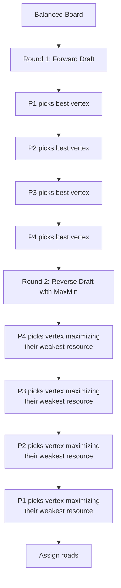

# MaxMin Fair Allocation

**File:** `src/logic/placement/placements.ts`

## What is it?

An algorithm that suggests fair initial settlement and road placements for all players. It ensures every player gets a balanced mix of resource access and production value.

## The Problem

In Catan, players place 2 settlements before the game starts using a **snake draft**:

```
Round 1: Player 1 → Player 2 → Player 3 → Player 4
Round 2: Player 4 → Player 3 → Player 2 → Player 1
```

A naive "pick the best spot" strategy creates imbalance:
- Player 1 gets the #1 spot in round 1
- Player 4 gets the #4 spot in round 1 (worst), but #1 in round 2 (best remaining)
- The quality of "best remaining" drops fast

## Our Approach: MaxMin

**MaxMin = Maximize the Minimum.** Each player's second settlement is chosen to maximize their weakest resource coverage, not just their total score.



## Vertex Scoring

Each vertex (intersection of 2-3 hexes) is scored for a specific player:

```
Score = Pip Sum + Diversity Bonus + Min Coverage Bonus
```

### Pip Sum
Sum of pips from all adjacent hexes. Higher = more production.

```
        ╭──────╮
       │ Wheat │
       │  (8)  │ ← 5 pips
        ╰──┬───╯
    ╭──────╮●╭──────╮
   │ Wood  │ │ Ore  │
   │  (6)  │ │  (4) │ ← 5 + 3 pips
    ╰──────╯ ╰──────╯

   Vertex ● pip sum = 5 + 5 + 3 = 13
```

### Diversity Bonus (+10 per new resource)

If a player already has access to Wood and Wheat from round 1, a vertex touching Ore and Brick scores +20 bonus (2 new resources).

```
Round 1 settlement: Wood, Wheat, Sheep
                    ✓     ✓      ✓

Round 2 candidate vertex: Ore, Brick, Wheat
                          +10   +10    +0
                          (new) (new)  (already have)

Diversity bonus = 20
```

### Min Coverage Bonus (+5 × minimum resource count)

Encourages covering all 5 resource types rather than stacking one.

```
Player resources after both settlements:
  Wood:  2 access points
  Wheat: 2 access points
  Sheep: 1 access point
  Brick: 1 access point
  Ore:   0 access points  ← minimum = 0

Min coverage bonus = 5 × 0 = 0 (bad — missing ore entirely)
```

vs.

```
  Wood:  1
  Wheat: 1
  Sheep: 1
  Brick: 1
  Ore:   1  ← minimum = 1

Min coverage bonus = 5 × 1 = 5 (better — all resources covered)
```

## Distance Rule

Catan requires settlements to be at least 2 edges apart. When a vertex is taken, all adjacent vertices are blocked:

```
    ○───○───○
    │       │
    ○───●───○    ● = settlement placed
    │       │    ○ = blocked (adjacent)
    ○───○───○    All other vertices = available
```

## Road Assignment

After placing a settlement, the algorithm assigns a road (edge) connected to it. It picks the edge that points toward the **best adjacent hex whose resource the player lacks**.

```
Player has: Wood, Wheat (from settlement)
Adjacent hexes via roads:
  → North edge leads toward Ore hex (need it!) ← PICK THIS
  → South edge leads toward Wood hex (already have it)
```

## Fairness Result

After placement, each player typically ends up with:
- Similar total pip count (within ~15% of each other)
- Access to 4-5 different resource types
- No player completely missing a critical resource

```
         Pips    Resources
Player 1:  18    Wood, Wheat, Sheep, Brick, Ore
Player 2:  17    Wood, Wheat, Sheep, Ore, Brick
Player 3:  19    Wheat, Sheep, Brick, Ore, Wood
Player 4:  18    Wood, Sheep, Brick, Ore, Wheat
                 ↑
                 All players have access to all 5 types
```
