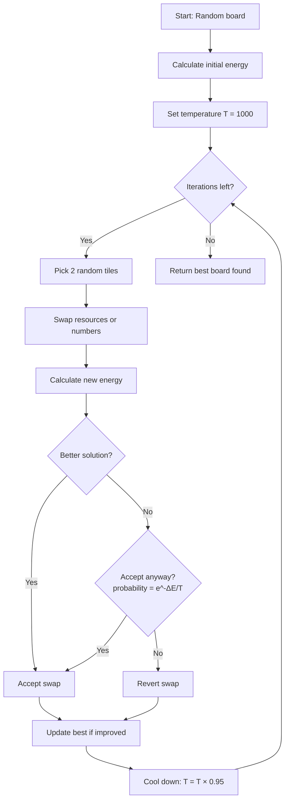

# Simulated Annealing

**File:** `src/logic/generation/generator.ts`

## What is it?

Simulated Annealing (SA) is an optimization algorithm inspired by the annealing process in metallurgy — heating metal and slowly cooling it to remove defects. Applied to Catan, it finds board layouts where resources and numbers are evenly distributed.

## Why not just random swap?

A naive approach (swap tiles only when it improves the board) gets stuck in **local minima** — states that seem good locally but aren't globally optimal.

```
Energy
  │
  │   ╭─╮
  │  ╭╯ ╰╮    ╭──╮
  │ ╭╯   ╰╮  ╭╯  ╰╮
  │╭╯     ╰──╯    ╰──── ← Global minimum (best)
  │╯  ↑
  │   Greedy gets stuck here (local minimum)
  └──────────────────────
```

SA solves this by **sometimes accepting worse solutions**, allowing it to escape local minima and explore the search space more broadly.

## The Algorithm



## Parameters

| Parameter | Value | Purpose |
|-----------|-------|---------|
| Initial temperature | 1000 | High = more exploration early on |
| Cooling rate | 0.95 | How fast temperature decreases per iteration |
| Iterations | ~300 | Total optimization steps |

## Temperature Effect

The temperature controls how likely the algorithm is to accept a worse solution:

```
Probability of accepting worse solution = e^(-ΔE / T)

High T (early):  e^(-10 / 1000) = 0.99  → Almost always accept
Low T (late):    e^(-10 / 1)    = 0.00  → Almost never accept
```

```
Acceptance Rate
  100% │████
       │█████
       │██████
       │████████
       │██████████
       │█████████████
       │████████████████████
    0% │█████████████████████████████████
       └──────────────────────────────────
       Hot ←── Temperature ──→ Cold
       (explore)              (exploit)
```

Early iterations **explore** broadly (accept bad moves). Later iterations **exploit** the best region found (only accept improvements).

## What Gets Swapped

Depends on the balance mode selected by the user:

| Mode | What swaps |
|------|------------|
| `resources` | Two hex resources swap positions |
| `numbers` | Two number tokens swap positions |
| `both` | Randomly picks resource or number swap each iteration |

## Convergence

Typically the algorithm converges within 100-200 iterations. The remaining iterations fine-tune:

```
Energy
  200 │╲
      │ ╲
  150 │  ╲
      │   ╲
  100 │    ╲___
      │        ╲___
   50 │            ╲________
      │                     ╲_______________
    0 │
      └─────────────────────────────────────
      0    50   100  150  200  250  300
                  Iterations
```

## Performance

~300 iterations with energy calculation runs in **< 10ms** in modern browsers. No Web Workers needed for the standard 19-hex board.
